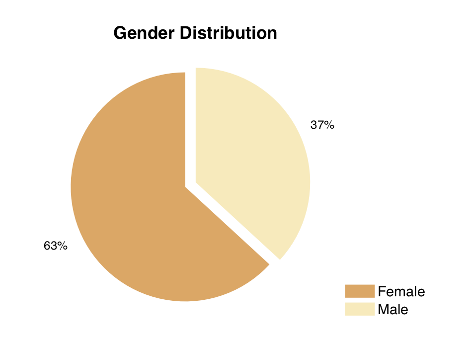
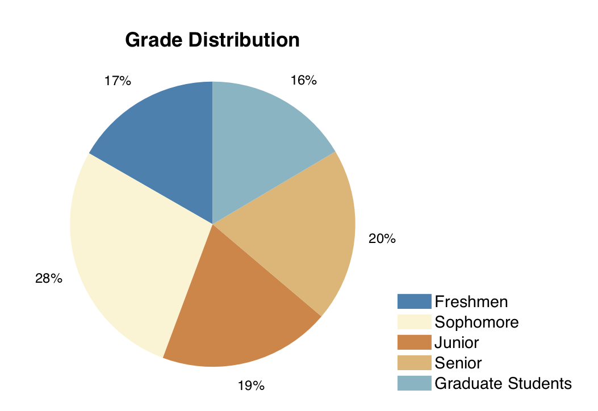
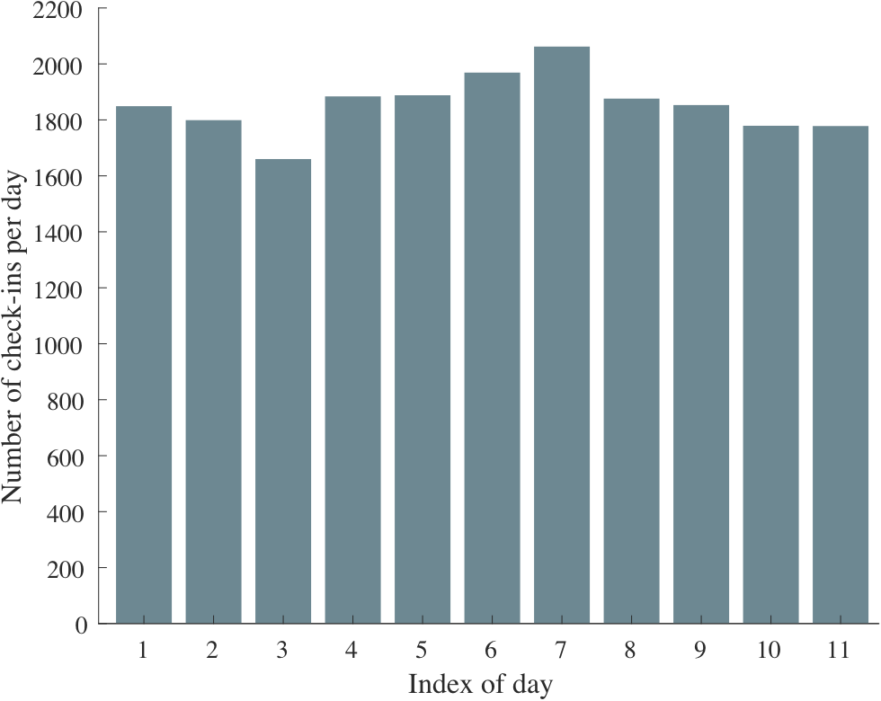
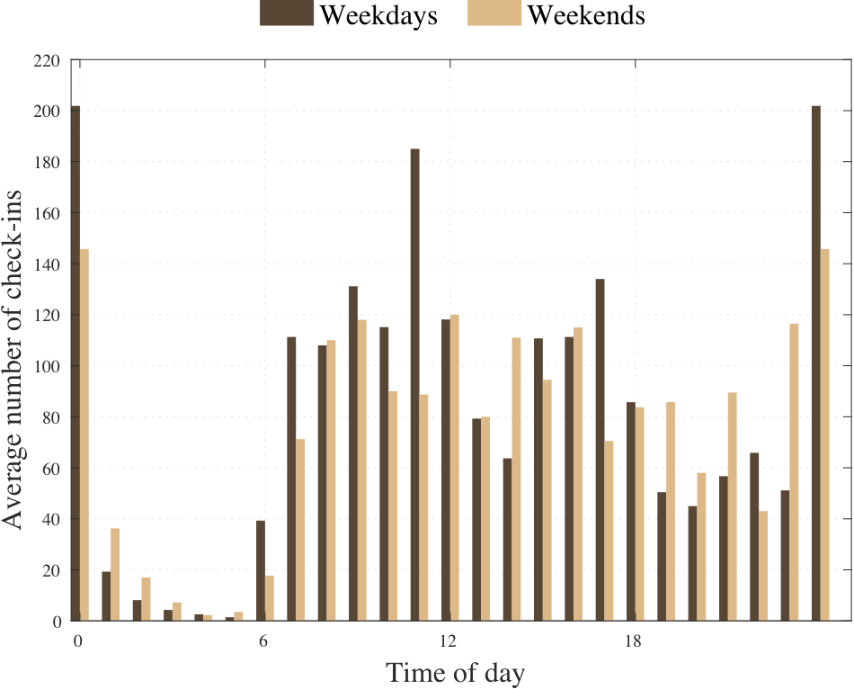
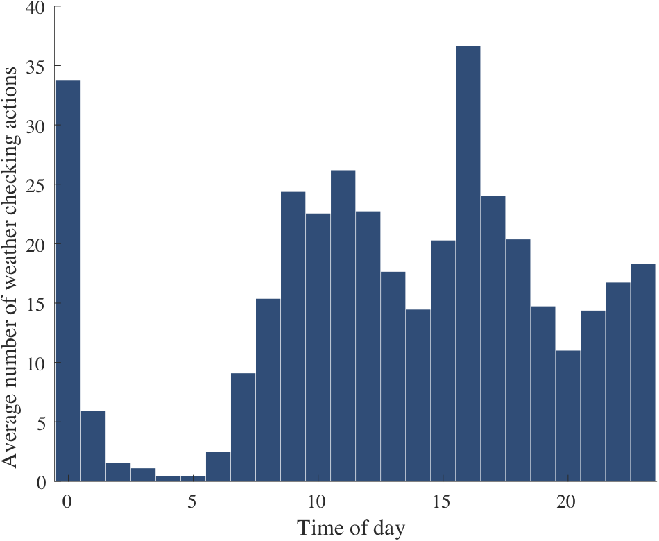
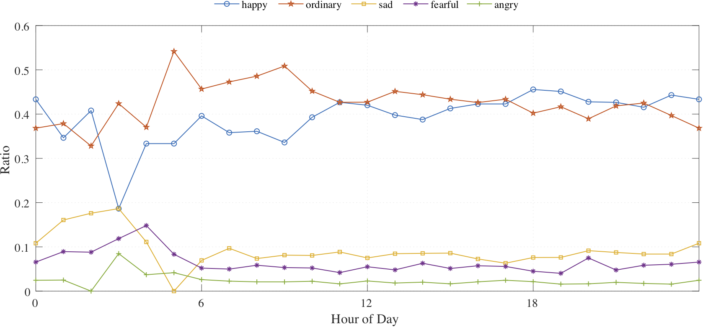
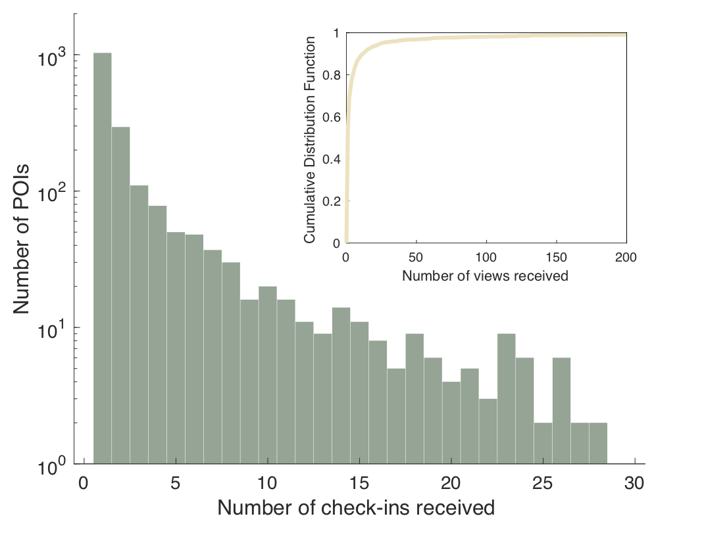
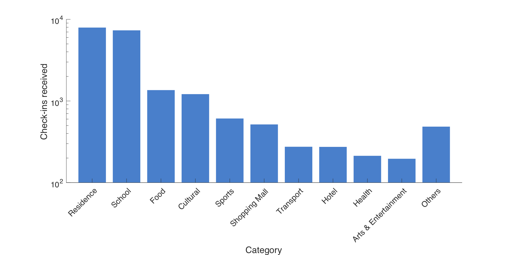

This is the MATLAB source code for some data analysis of our [**LBSLab dataset**](https://www.sciencedirect.com/science/article/pii/S2352340923000161). The [dataset](https://figshare.com/articles/dataset/A_Human_Mobility_Dataset_Collected_via_LBSLab/15000384/3) is open for downloads. For more details, please refer to our [paper](https://evelyn0414.github.io/file/LBSLab_data.pdf)

### User demographic

### Temporal patterns

### Mood trend

### POI distribution

